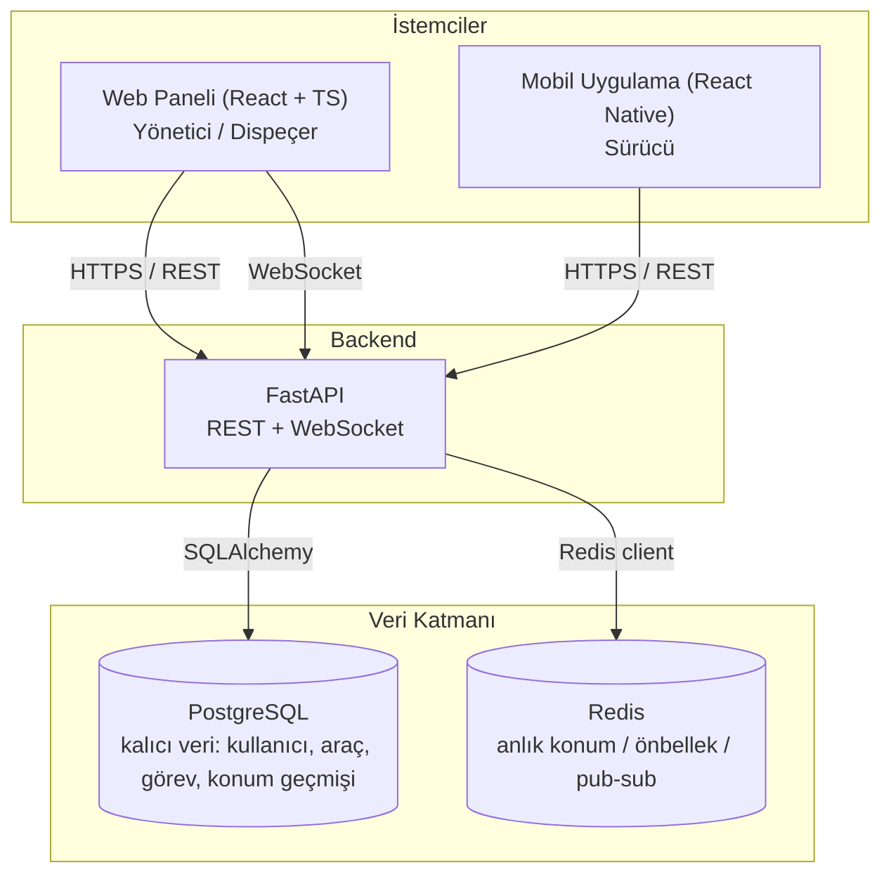

# Gereksinimler ve Mimari — Kargo Aracı Takip Sistemi

## 1. Sistem özeti

Kargo şirketlerinin araçlarını ve sürücülerini gerçek zamanlı izleyip görev atayabildiği,
rol bazlı erişimli bir takip sistemi. Üç rol vardır: **Yönetici**, **Dispeçer**, **Sürücü**.
Web paneli (masaüstü kullanım — yönetici/dispeçer) ve mobil uygulama (saha kullanımı — sürücü)
aynı backend'e bağlanır.

## 2. Fonksiyonel gereksinimler (kim → ne yapabilir)

### Yönetici
- Kullanıcı oluşturur/siler, rol atar (Yönetici/Dispeçer/Sürücü).
- Tüm araçları, sürücüleri ve görevleri görüntüler.
- Sistem geneli raporlara erişir (araç sayısı, aktif görevler, geçmiş konum kayıtları).
- Dispeçer'in yapabildiği her şeyi yapabilir.

### Dispeçer
- Araç ve sürücü listesini görüntüler, yeni araç kaydı oluşturur.
- Sürücülere görev atar, görev durumunu izler.
- Tüm araçların canlı konumunu haritada izler.
- "Bağlantı koptu" / gecikme uyarılarını görür.
- Kullanıcı yönetimi **yapamaz** (yönetici yetkisi değil).

### Sürücü
- Sadece kendine atanmış görevi ve kendi aracının bilgisini görür.
- Görev durumunu günceller (başladı / yolda / tamamlandı).
- Mobil uygulama üzerinden konumunu backend'e gönderir (otomatik, periyodik).
- Başka sürücülerin verisine **erişemez**.

## 3. Fonksiyonel olmayan gereksinimler

| Kategori | Gereksinim | Not |
|---|---|---|
| Ölçek | ~50-200 araç, birkaç dispeçer, 1-2 yönetici | Öğrenme projesi ölçeği; mimari daha büyüğe genişleyebilir olmalı ama şimdilik aşırı optimize edilmeyecek |
| Gecikme | Konum güncellemesi 1-5 sn içinde bağlı istemcilere yansımalı | WebSocket ile sağlanacak (Aşama 4) |
| Hassas veri | Şifreler (hash'li), konum geçmişi, JWT token'lar | Şifre asla düz metin saklanmaz; konum verisi kişisel veri sayılır, sadece yetkili roller görür |
| Dayanıklılık | PostgreSQL = kalıcı veri kaynağı; Redis = geçici/hızlı erişim katmanı | Redis çökerse sistem yavaşlar ama veri kaybı olmaz — kalıcı veri PostgreSQL'de |
| Güvenlik | Rol bazlı erişim (RBAC), input validation, prod'da HTTPS | Aşama 3 ve 7'de detaylandırılacak |
| Kullanılabilirlik | Backend yeniden başlatılabilir (stateless API) | Docker ile paketlenip tek komutla ayağa kalkacak (Aşama 7) |

## 4. Mimari

**Katmanların sorumluluğu:**
- **İstemciler:** Sadece görüntüleme ve kullanıcı etkileşimi. Yetki kararı vermez, sadece
  backend'in verdiği veriyi gösterir/gizler.
- **Backend (FastAPI):** Tüm iş mantığı, kimlik doğrulama/yetkilendirme, girdi doğrulama,
  WebSocket bağlantı yönetimi burada. Tek backend, iki istemciye (web + mobil) hizmet verir.
- **PostgreSQL:** Tek doğruluk kaynağı (source of truth). Kullanıcı, araç, görev, konum geçmişi
  ilişkisel olarak burada tutulur.
- **Redis:** Araçların *en güncel* konumu (hızlı okuma), WebSocket pub/sub dağıtımı, kısa ömürlü
  önbellek. Kalıcı veri değil — kaybolsa sistem çalışmaya devam eder, sadece "en güncel konum"
  cache'i yeniden ısınır.

## 5. Teknoloji seçimleri ve nedenleri

| Seçim | Neden | Alternatif ve neden elenmedi/elendi |
|---|---|---|
| **FastAPI** | Async destekli, Pydantic ile otomatik girdi doğrulama, otomatik OpenAPI/Swagger dokümantasyonu, öğrenme eğrisi düşük | Django: "her şey dahil" ama gerçek zamanlı (WebSocket) ve async akışlar için FastAPI daha hafif ve doğal |
| **PostgreSQL** | Veri açıkça ilişkisel (kullanıcı↔araç↔görev↔konum foreign key'lerle bağlı), ACID garantisi önemli (görev/konum kaydı tutarlılığı) | MongoDB: şema esnekliği burada avantaj değil — ilişkileri JOIN yerine uygulama kodunda simüle etmek gerekirdi |
| **Redis** | Anlık konum verisi için düşük gecikmeli okuma/yazma, pub/sub ile WebSocket mesaj dağıtımı doğal destekleniyor | Sadece PostgreSQL: her konum güncellemesinde ilişkisel tabloya yazmak + okumak, yüksek frekanslı konum akışı için gereksiz yük olurdu |
| **React + TypeScript + Vite** | Tip güvenliği (özellikle rol bazlı UI mantığında hata azaltır), Vite ile hızlı geliştirme deneyimi | Yalın JS: tip hataları runtime'a kadar görünmez, büyüyen projede riskli |
| **React Native** | Web'de öğrenilen React mantığı mobilde yeniden kullanılır, tek ekip/tek bilgiyle iki platform | Ayrı native (Kotlin/Swift): iki kat öğrenme yükü, bu proje kapsamında gereksiz |
| **Docker** | "Benim makinemde çalışıyordu" sorununu ortadan kaldırır, backend+PostgreSQL+Redis tek komutla ayağa kalkar | Yerel kurulum: her yeni makinede manuel kurulum tekrarı, taşınabilirlik yok |

## 6. Kapsam dışı (bu proje için bilinçli olarak yapılmayacaklar)

- Çoklu bölge (multi-region) dağıtım, yüksek erişilebilirlik (HA) kümeleme — öğrenme projesi
  ölçeğinde gereksiz karmaşıklık.
- Gerçek harita/rota optimizasyonu (örn. en kısa yol hesaplama) — konum *gösterimi* var,
  rota *planlaması* yok.
- Ödeme/faturalama modülü — kapsam dışı.
