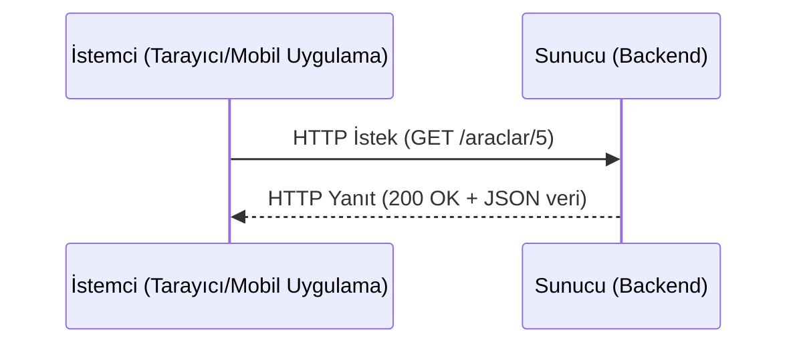
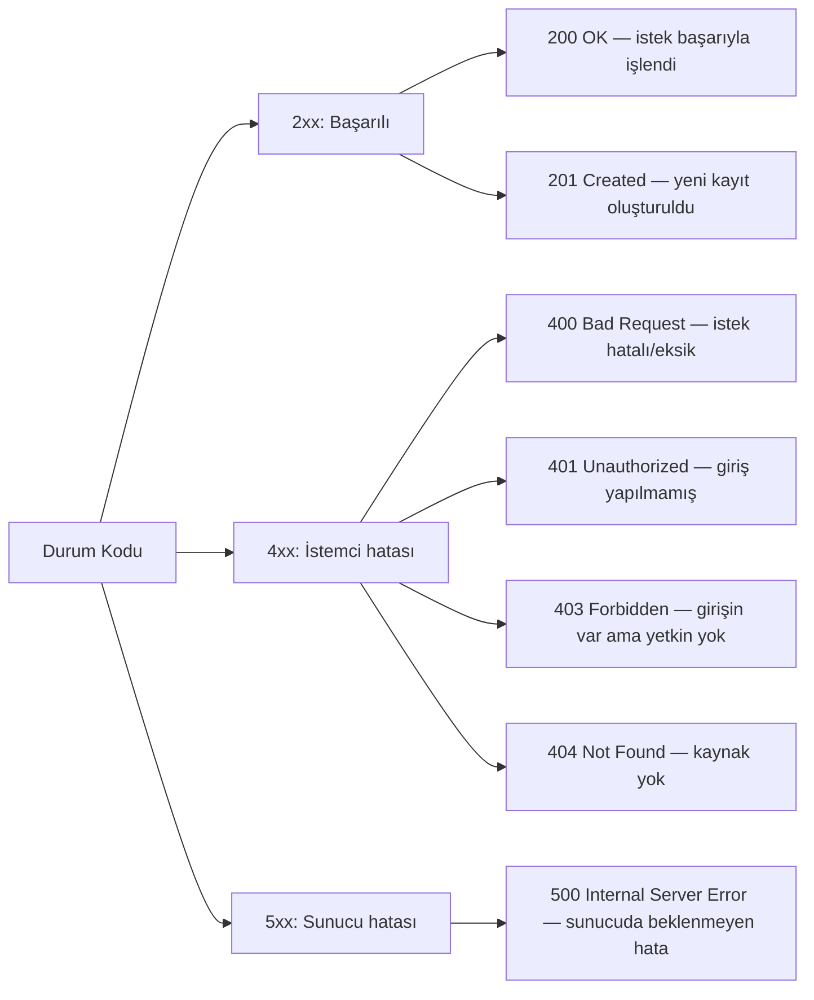
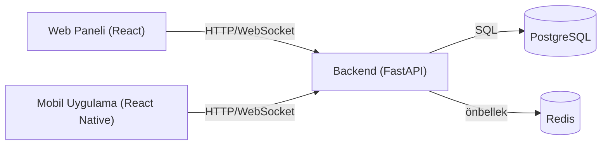
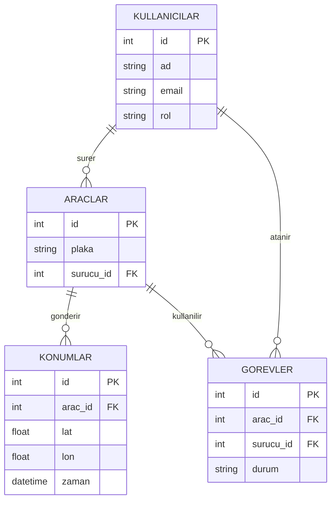

# Kavram Notları

Bu dosya, yol haritasının her aşamasında öğrenilen kavramların kısa özetlerini biriktirir.
Amaç mülakat öncesi hızlı tekrar yapabilmek. Her bölüm kendi başına okunabilir.

---

## Aşama 0 — Temeller

### 1) HTTP nasıl çalışır?

Web'de her şey aslında şu basit döngüden ibaret: **istemci bir istek (request) gönderir,
sunucu bir yanıt (response) döner.**



Bir HTTP isteği üç parçadan oluşur:
- **Method + Path:** `GET /araclar/5` → "5 numaralı aracın bilgisini getir"
- **Header'lar:** Ek bilgi (`Authorization: Bearer <token>`, `Content-Type: application/json`)
- **Body (gövde):** POST/PUT gibi isteklerde gönderilen veri (genelde JSON)

**HTTP metodları — "hangi fiil ne işe yarar":**

| Method | Anlamı | Kargo projesi örneği |
|---|---|---|
| GET | Veri oku | Araç listesini getir |
| POST | Yeni veri oluştur | Yeni araç ekle |
| PUT/PATCH | Var olanı güncelle | Aracın konumunu güncelle |
| DELETE | Sil | Aracı sistemden çıkar |

**Durum kodları — sunucunun cevabı nasıl özetlediği:**



**Aklında kalsın:** 401 vs 403 mülakatlarda sık karıştırılır.
- **401** = "Sen kimsin, giriş yapmamışsın" (kimlik doğrulama eksik)
- **403** = "Seni tanıyorum ama bu işe yetkin yok" (yetkilendirme reddi)

### 2) REST API nedir?

REST, kaynakları (resource) URL'ler üzerinden, standart HTTP metodlarıyla yönetmenin bir
konvansiyonudur. "Uç nokta (endpoint)" dediğimiz şey = **URL + HTTP method** kombinasyonu.

```
GET    /araclar          → tüm araçları listele
GET    /araclar/5        → 5 numaralı aracı getir
POST   /araclar          → yeni araç oluştur
PUT    /araclar/5        → 5 numaralı aracı güncelle
DELETE /araclar/5        → 5 numaralı aracı sil
```

Neden bu kadar popüler:
- **Stateless (durumsuz):** Sunucu iki istek arasında istemciyle ilgili bir şey "hatırlamaz",
  her istek kendi başına yeterli bilgiyi taşır (örn. token header'da gelir).
- **Kaynak odaklı:** URL bir *isim* olmalı (`/araclar`), bir *fiil* değil (`/araclarigetir` gibi değil).
- **JSON ile konuşma:** İstek/yanıt gövdesi genelde JSON — hem web hem mobil hem başka bir backend
  aynı formatı okuyabilir.

Örnek JSON yanıtı:
```json
{
  "id": 5,
  "plaka": "34 ABC 123",
  "surucu_id": 12,
  "son_konum": { "lat": 41.015, "lon": 28.979 }
}
```

### 3) İstemci-sunucu ayrımı



- **İstemcide (tarayıcı/telefon) çalışan:** Arayüz, kullanıcı etkileşimi, "görünüm" mantığı.
  İstemci kodunu herkes tarayıcının geliştirici araçlarından görebilir — **asla gizli/güvenilir
  bilgi tutmaz.**
- **Sunucuda çalışan:** Asıl iş mantığı, veritabanı erişimi, yetki kontrolü, şifre doğrulama.
  Güvenlik kararları **her zaman** sunucuda verilir; istemci sadece "iyi niyetli" arayüz sağlar.

**Neden önemli:** Bir sürücü uygulamasında "Sil" butonunu arayüzden gizlemek yetmez — sunucu
tarafında da "bu kullanıcı silme yetkisine sahip mi?" kontrolü olmalı. Yoksa biri tarayıcıdan
doğrudan `DELETE /araclar/5` isteği atarak butonu bypass edebilir.

**Aynı backend, çok istemci:** Kargo projesinde hem web paneli hem mobil uygulama **aynı**
FastAPI backend'ine konuşacak. Bu yüzden iş mantığını backend'de tek yerde tutmak, istemcilerde
tekrar etmemek kritik.

### 4) Temel SQL

İlişkisel veritabanı = tablolardan oluşan, aralarında **ilişki** kurulabilen bir yapı.



- **Primary key (birincil anahtar):** Bir satırı tekil olarak tanımlayan sütun (`id`).
- **Foreign key (yabancı anahtar):** Başka bir tablonun primary key'ine referans veren sütun.
  `araclar.surucu_id` → `kullanicilar.id` demek "bu araç şu kullanıcıya ait".
- Bu referans sayesinde aynı veriyi (kullanıcı bilgisi) her satırda tekrar etmeyiz —
  buna kabaca **normalizasyon** denir.

**Temel sorgular:**
```sql
-- Tüm araçları listele
SELECT * FROM araclar;

-- Sadece belirli sürücünün araçlarını getir
SELECT * FROM araclar WHERE surucu_id = 12;

-- Yeni araç ekle
INSERT INTO araclar (plaka, surucu_id) VALUES ('34 ABC 123', 12);

-- Aracın son konumunu güncelle
UPDATE araclar SET son_konum_id = 88 WHERE id = 5;

-- Bir aracı sürücü bilgisiyle birlikte getir (JOIN)
SELECT araclar.plaka, kullanicilar.ad
FROM araclar
JOIN kullanicilar ON araclar.surucu_id = kullanicilar.id;
```

**JOIN mantığı:** İki tabloyu ortak bir sütun (genelde FK ↔ PK) üzerinden "yan yana" getirir.
Yukarıdaki örnek: "araçları, sürücülerinin adıyla birlikte listele."

---

## Aşama 1 — STRIDE ile basit tehdit modeli

STRIDE, bir sistemi "kötüye kullanma" açısından altı kategoride sorgulamanın bir yolu.
Her harf bir tehdit türü. Amaç kod yazmadan önce "bu bileşen nasıl istismar edilir?" diye
sormak — güvenliği sona bırakmak yerine baştan tasarıma dahil etmek (**security by design**).

| Harf | Tehdit türü | Sorulan soru |
|---|---|---|
| **S**poofing | Kimlik taklidi | Biri başkasıymış gibi davranabilir mi? |
| **T**ampering | Veri bozma | Biri iletilen/saklanan veriyi değiştirebilir mi? |
| **R**epudiation | İnkâr edebilme | Biri yaptığı bir işlemi inkâr edebilir mi (log yoksa)? |
| **I**nformation Disclosure | Bilgi sızıntısı | Yetkisiz biri hassas veriye erişebilir mi? |
| **D**enial of Service | Hizmeti aksatma | Biri sistemi kullanılamaz hale getirebilir mi? |
| **E**levation of Privilege | Yetki yükseltme | Düşük yetkili biri kendine daha fazla yetki verebilir mi? |

### Kargo Aracı Takip Sistemi'ne uygulanışı

| Bileşen | Tehdit (STRIDE) | Somut senaryo | Önlem (nerede ele alınacak) |
|---|---|---|---|
| Giriş uç noktası (`/auth/login`) | Spoofing | Biri başka bir sürücünün hesabıyla giriş yapmaya çalışır (şifre tahmini/brute-force) | bcrypt hash + rate limiting; başarısız girişleri logla — **Aşama 3, 7** |
| JWT token | Tampering | Biri token içindeki `rol` alanını değiştirip "yönetici" gibi davranmaya çalışır | Token sunucu tarafında imzalanır (HMAC/RS256), imza doğrulanmadan hiçbir alan güvenilmez — **Aşama 3** |
| Konum güncelleme uç noktası (`POST /araclar/{id}/konum`) | Tampering | Sürücü A, kendi token'ıyla sürücü B'nin aracının konumunu güncellemeye çalışır | Uç nokta, token'daki kullanıcı ile hedef `arac_id`'nin sahibi olup olmadığını kontrol eder — **Aşama 3** |
| Görev durumu güncelleme | Repudiation | Bir görev "tamamlandı" olarak işaretlenir ama kim yaptığı belli değil | Her state-değişikliğine `kullanici_id` + zaman damgası ile log tutulur — **Aşama 7 (loglama)** |
| Kullanıcı/araç/konum verisi | Information Disclosure | Sürücü, `GET /araclar` çağırıp tüm filonun konumunu görür (sadece kendi aracını görmeli) | Her uç noktada role göre veri filtrelenir, sadece yetkili olduğu satırlar döner — **Aşama 3 (RBAC)** |
| Hata mesajları | Information Disclosure | 500 hatasında stack trace veya SQL sorgusu istemciye sızar | Prod'da jenerik hata mesajı, detay sadece sunucu logunda — **Aşama 7 (güvenlik gözden geçirme)** |
| Konum güncelleme uç noktası | Denial of Service | Bir istemci saniyede binlerce sahte konum isteği gönderir, backend/veritabanını boğar | Rate limiting, makul istek sıklığı doğrulaması — **Aşama 7** |
| Görev atama / kullanıcı yönetimi uç noktaları | Elevation of Privilege | Sürücü rolündeki bir kullanıcı, doğrudan `POST /kullanicilar` çağırıp kendine yönetici rolü atar | Her yazma uç noktasında zorunlu rol kontrolü (dependency/middleware), sadece Yönetici bu uç noktayı çağırabilir — **Aşama 3 (RBAC)** |

**Çıkarım:** Bu tabloda tekrar eden tek bir prensip var — **istemciden gelen hiçbir veriye
(token içeriği dahil) güvenme, her yazma/okuma işleminde sunucu tarafında rol + sahiplik
kontrolü yap.** Aşama 3'te RBAC'ı kurarken bu tablo bir kontrol listesi gibi kullanılacak.

---

*(Sonraki aşamalarda buraya JWT, WebSocket, ORM, RBAC gibi kavramlar eklenecek.)*
